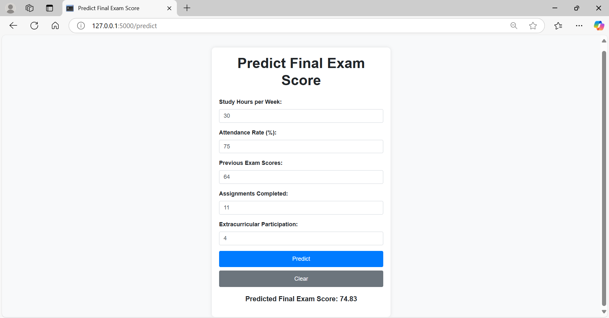

# Student Performance Prediction Model

This repository contains a machine learning model to predict student performance in final exams based on various features such as study habits, attendance, and previous exam scores. The model uses Lasso Regression with a 60:40 train-test split, selected for its balance between accuracy and interpretability. This project is intended for educators, data scientists, and researchers interested in understanding and predicting academic success based on key student metrics.

## Features

The model leverages several features:
- **Study Hours per Week**: The average number of hours a student studies each week.
- **Attendance Rate**: A percentage representing student attendance.
- **Previous Exam Scores**: Scores from past exams, indicating prior academic performance.
- **Assignments Completed**: The number of assignments completed during the course.
- **Extracurricular Participation**: Involvement in extracurricular activities.
- **Study-Attendance Interaction**: Interaction term of study hours and attendance rate.
- **Study Hours Squared**: The squared value of study hours to capture non-linear effects.
- **Attendance Rate Squared**: The squared value of attendance rate for non-linear effects.

## Model Overview

The model was developed using Python and includes the following steps:
1. **Data Preprocessing**: Handling missing values, scaling features using StandardScaler, and creating interaction terms.
2. **Model Selection**: Lasso Regression with a 60:40 data split was chosen due to its high R² score and low Mean Squared Error (MSE), providing strong predictive performance and interpretability.
3. **Training and Evaluation**: The model is trained on the training data and evaluated on the test data to measure performance. The best-performing model achieved an R² score of 0.8407 and an MSE of 24.93.

## Installation

1. Clone the repository:
   ```bash
   git clone https://github.com/Gohxuann/student_performance_prediction.git
   ```
2. Navigate to the project directory:
   ```bash
   cd student_performance_prediction
   ```
3. Install the required packages:
   ```bash
   pip install -r requirements.txt
   ```

## Usage

1. Ensure your dataset is properly formatted and available.
2. Run the model training script:
   ```bash
   python train_model.py
   ```
3. To make predictions, load the pre-trained model and scaler, then input new student data:
   ```python
   # Example
   import pickle
   with open('best_lasso_model.pkl', 'rb') as model_file, open('scaler.pkl', 'rb') as scaler_file:
       model = pickle.load(model_file)
       scaler = pickle.load(scaler_file)
       # Assuming `new_student_data` is a DataFrame with the same columns as the training data
       new_student_data_scaled = scaler.transform(new_student_data)
       prediction = model.predict(new_student_data_scaled)
   print("Predicted Final Exam Score:", prediction)
   ```

## Results

The model provides a robust tool for predicting student performance based on key academic and behavioral metrics. By using Lasso Regression, the model achieves high accuracy while simplifying the feature set, making it easier to interpret the factors contributing to academic success.

## Screenshot

Below is a screenshot of the **Student Performance Prediction** interface:



> Replace `path/to/your-image.png` with the path to your image in the repository.

## License

This project is licensed under the MIT License.

## Contributing

Contributions are welcome! If you would like to contribute, please fork the repository, create a new branch for your feature or bug fix, and submit a pull request.

